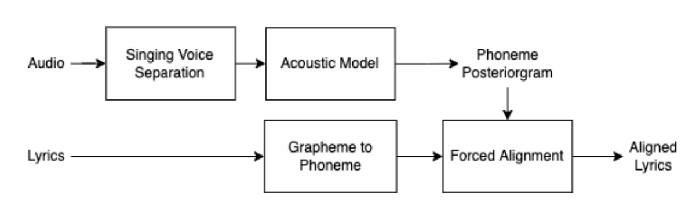

# Zalo AI Challenge 2022 - Lyric Alignment

This is a solution for track Lyric Alignment - From team VTS-HTML.

## Description

Details are at the link of the [ZaloAI - Lyric Alignment](https://challenge.zalo.ai/portal/lyric-alignment)

## Solutions 

### Overview

Our method is based on paper [Improving Lyrics Alignment through Joint Pitch Detection](https://arxiv.org/pdf/2202.01646.pdf) by Jiawen Huang, Emmanouil Benetos, Sebastian Ewer, (ICASSP). 2022.

The overview will be discussed below this figure

### Vocal Extraction

Realizing that in the ZaloAI dataset there are many songs with fast tempo and difficult to hear the vocals, so we decided to preprocess the audio with a **small module** [Vocal remover](https://github.com/tsurumeso/vocal-remover) by Tsurumeso. From now on, we have an audio file with the sound containing only clear vocals.

### Acoustic Model

The acoustic model takes the Mel-spectrogram of the separated vocals as input, and produces the phoneme posteriorgram.

It consists of a convolutional layer, a residual convolutional block, a fully-connected layer, 3 bidirectional LSTM (Long Short-Term Memory) layers, a final fullyconnected layer, and non-linearities in between. Model trained using CTC Loss.

### Alignment Process

The alignment process use Viterbi forced alignment. This can be computed efficiently via dynamic programming.

### Problem with datasets

First, we tried to fine-tuning this method on ZaloAI 2022 datasets, the results in the public leaderboard seem not good $\\approx 0.51$. After EDA data of training set, we realized that Ground-truth has been misalignment quite a bit (easily check this by [audacity](https://www.audacityteam.org/download/)).

So we used the [pretrained baseline](https://github.com/jhuang448/LyricsAlignment-MTL/blob/main/checkpoints/checkpoint_Baseline) to create **pseudo labels**. 

However, instead of using 100% pseudo-labels. We calculate IoU between pseudo-labels and GT from ZaloAI Datasets. If IoU is less than 0.7, we will use pseudo-label, otherwise we will use GT from Zalo. (approximate 1/3 total samples)

After training with this dataset, the results improved significantly $\\approx 0.57$. 

### Post-processing

The predicted results of our model are quite close to reality. However, if you pay close attention, GT has a characteristic that **the end time** of the previous word and **the start time** of the following word is the same. So we extend the gaps between the start and end times of two adjacent words into the previous word. This improves our results quite a bit $\\approx 0.60$.

## Usage

Check the [notebook](https://github.com/vieduy/zac2022-lyric-alignment/blob/main/predict_notebook.ipynb) for a quick example.

### Training and Dataset

Update later...

## References

[1] Jiawen Huang, Emmanouil Benetos, Sebastian Ewert, "Improving Lyrics Alignment through Joint Pitch Detection," International Conference on Acoustics, Speech and Signal Processing (ICASSP). 2022.

[2] https://github.com/tsurumeso/vocal-remover

[3] Gabriel Meseguer-Brocal, Alice Cohen-Hadria, and Geoffroy Peeters, “Creating DALI, a large dataset of synchronized audio, lyrics, and notes,” Transactions of the International Society for Music Information Retrieval, vol. 3, no. 1, pp. 55–67, 2020.

## Contact

Hoang Vien Duy

hoangduy.cqb.2k@gmail.com
